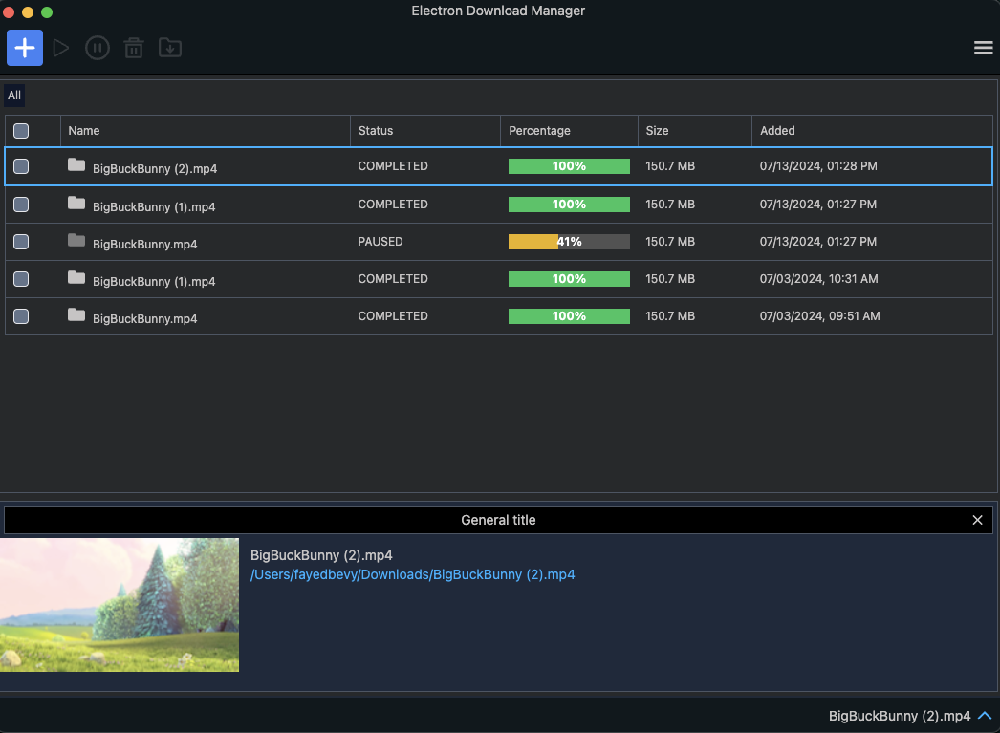
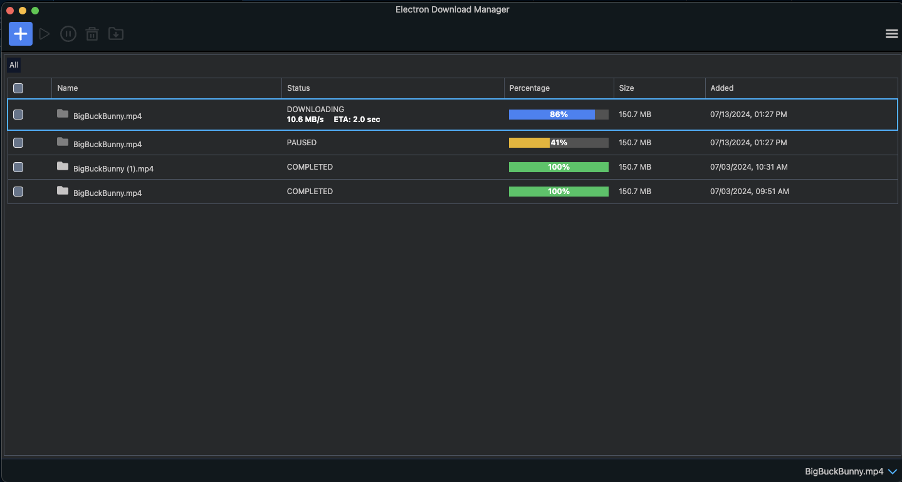
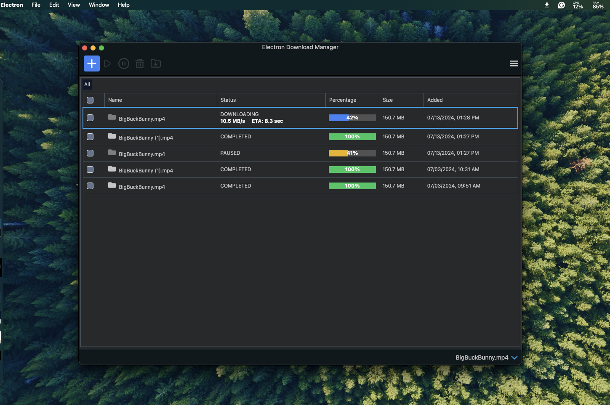

# Desktop download manager

Download manager for your desktop

## Description

This is a Desktop application for downloading and managing files. Add links to the download queue and get started with the download.

## Project setup

To serve the app locally `yarn start`

To build the app `yarn make`

To publish the app `yarn publish`

## Demo

## Version History

- 1.0.0
  - Initial Release

## Help

Any advise for common problems or issues.

# Authors

Contributors names and contact info

[@Esterfied](https://github.com/esterified)
